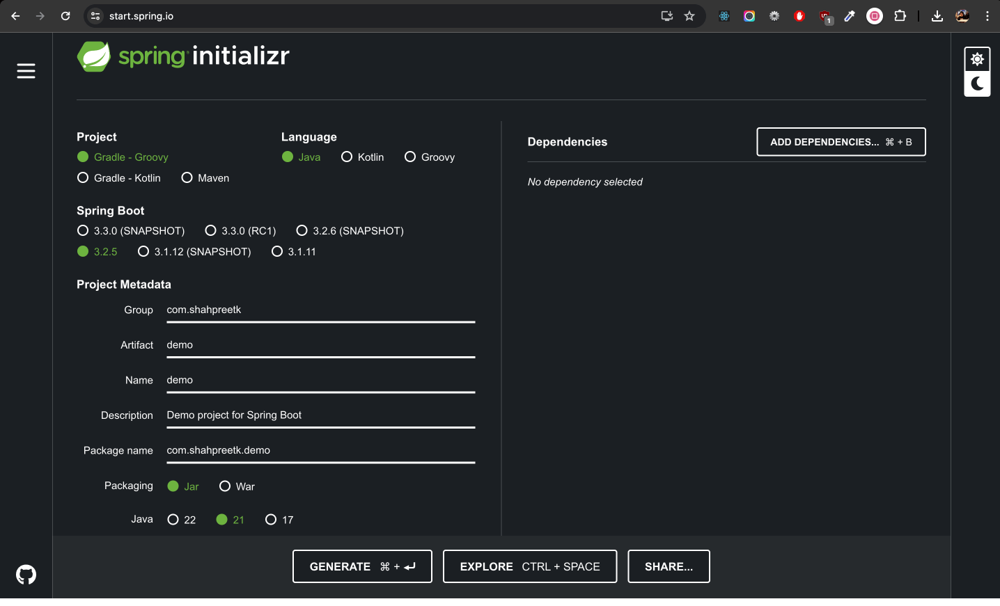
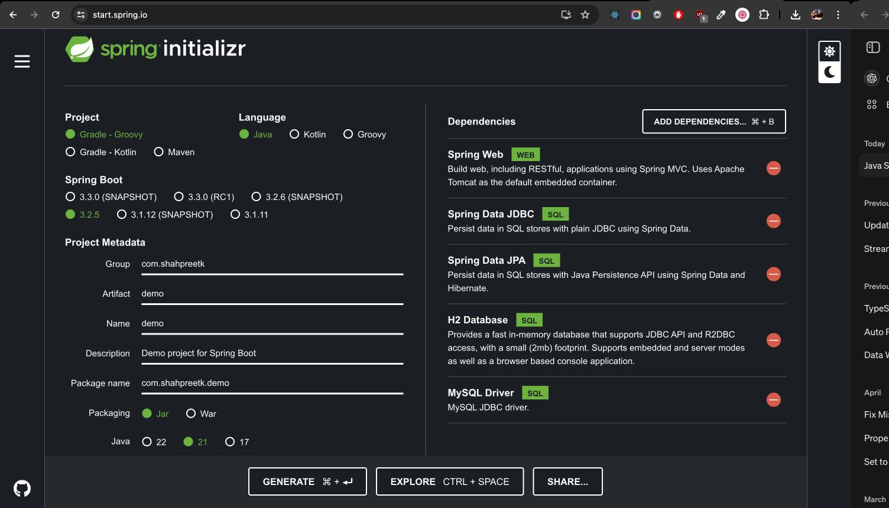
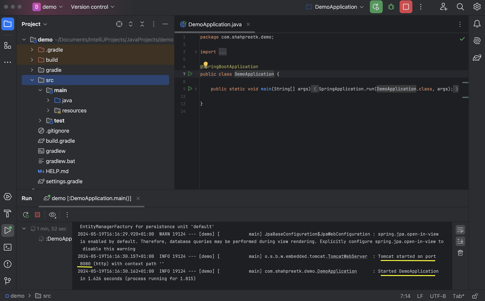
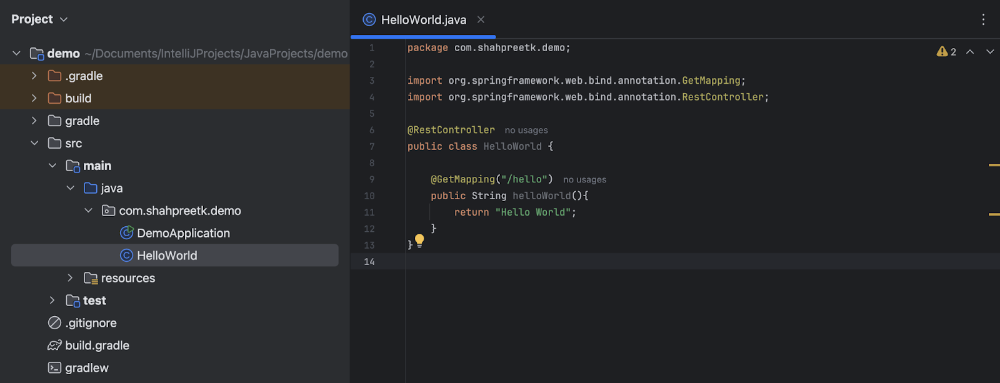
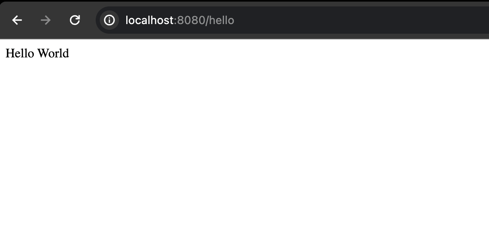
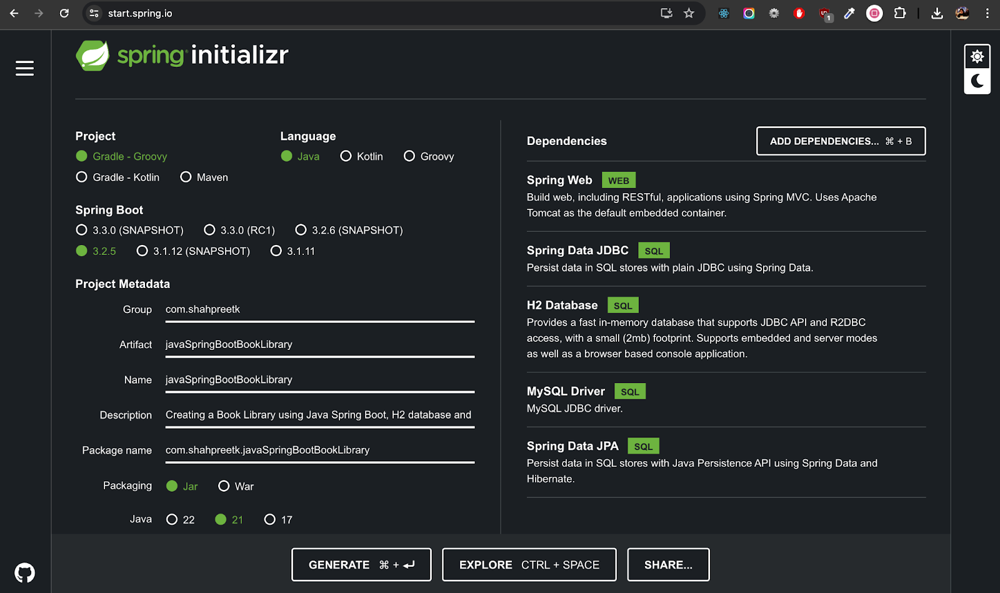
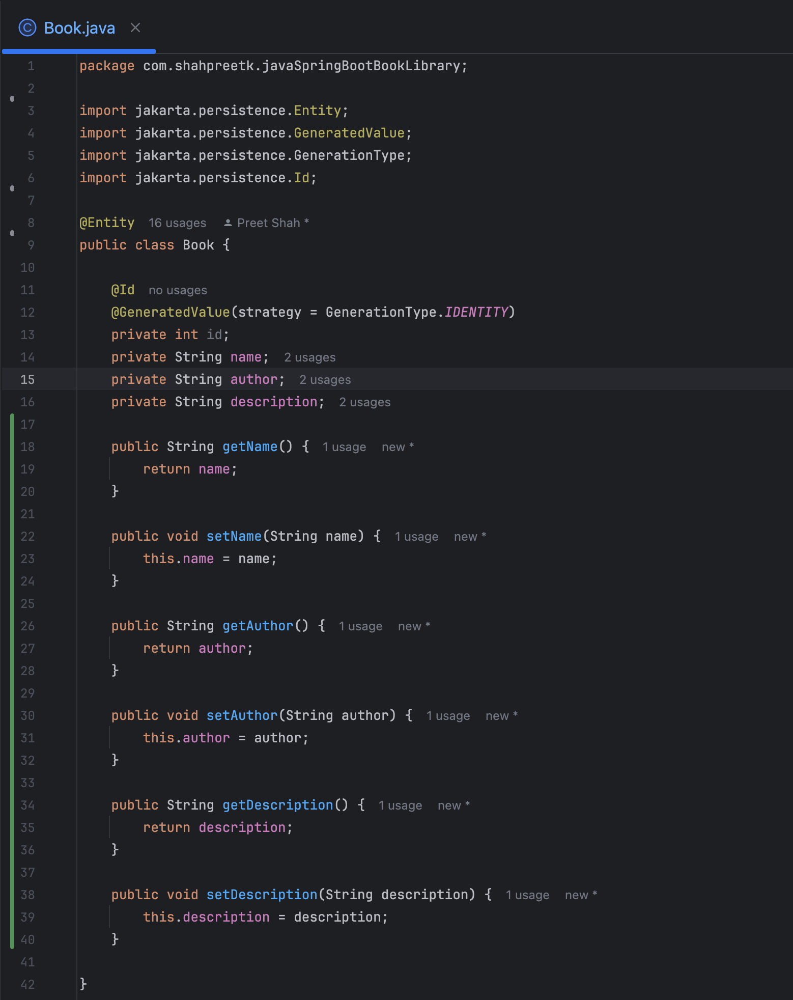
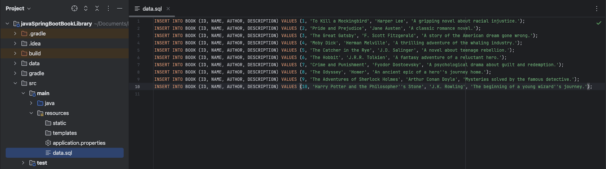
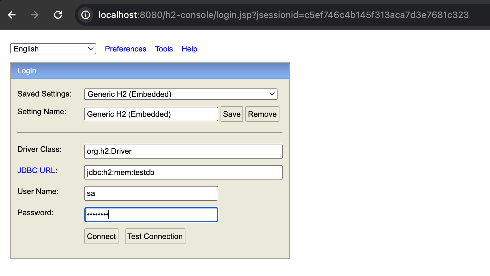
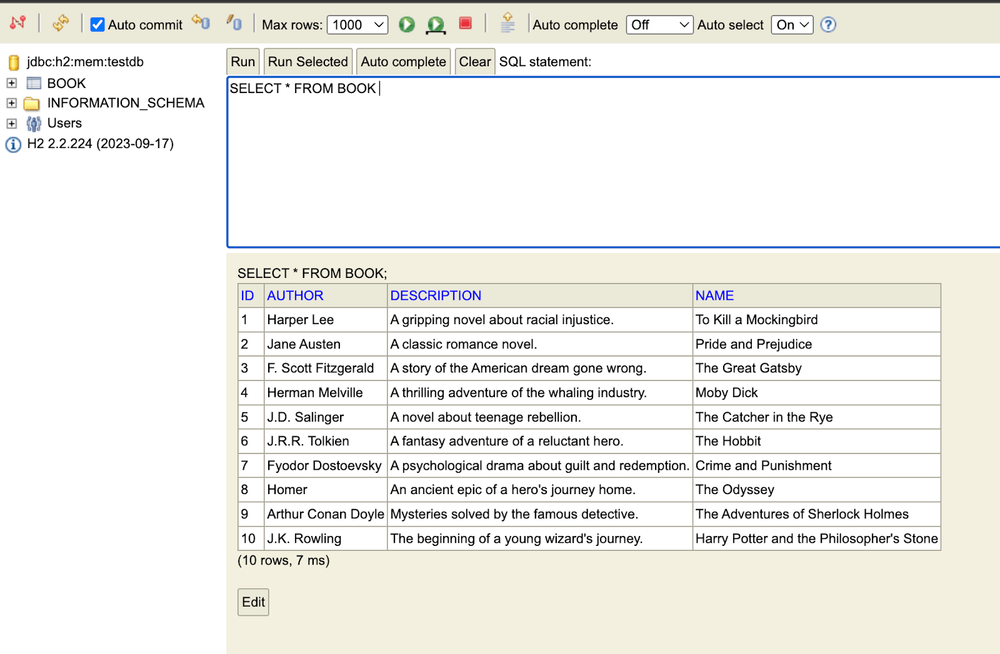

## Initial Setup for a Java Spring Boot Project

In this blog post, we will cover the initial steps to set up a Java Spring Boot project using Gradle and IntelliJ IDEA. Spring Boot is a popular framework for building Java applications, providing a robust and efficient platform for developing web applications, RESTful APIs, and microservices.

<!-- truncate -->

- It is not possible to directly create a new Spring Boot application in **IntelliJ IDEA Community Edition**. However, you can create a new Spring Boot project using the [Spring Initializr](https://start.spring.io/) website and then import it into IntelliJ IDEA.

|  |
| ------------------------------------------------------------ |

- Add the following dependencies as shown in the image below:
  - **Spring Web:** Provides tools and features to build web applications, including RESTful APIs, using Spring MVC.

  - **Spring Data JDBC:** Simplifies database access by providing a simple, lightweight approach to using JDBC with Spring, focusing on SQL queries.

  - **Spring Data JPA:** Eases database access by providing a repository abstraction layer on top of JPA (Java Persistence API) to simplify CRUD operations and data access patterns.

  - **H2 Database:** A fast, lightweight, in-memory relational database management system that is commonly used for development and testing purposes.

  - **MySQL Driver:** Enables Java applications to connect to and interact with MySQL databases by providing the necessary JDBC (Java Database Connectivity) implementation.

|  |
| ------------------------------------------------------------ |

- After adding the dependencies, click on the `Generate` button to download the project as a zip file.

- Extract the downloaded zip file and open the project in IntelliJ IDEA.

- Run the DemoApplication file to start the project. By default, the project will run on port 8080.

|  |
| ------------------------------------------------------------ |

- In the folder containing the `DemoApplication` file, create a new class named `HelloWorld`.
  - Annotate the `HelloWorld` class as a `@RestController` from the `org.springframework.web.bind.annotation` package.
  - In the `HelloWorld` class, create a method named `helloWorld` that returns a `String "Hello World"`.
  - Annotate the method with `@GetMapping` and provide the path as `"/hello"`.

:::note
An annotation in Java is a form of metadata that provides additional information about the program's code elements, such as classes, methods, or variables, and can be used to influence program behavior at runtime or compile time.
:::

|  |
| ------------------------------------------------------------ |

- Run the project and navigate to `http://localhost:8080/hello` in your browser. You should see the message "Hello World" displayed on the screen.

|  |
| ------------------------------------------------------------ |

## Setup of a Book Library Project

In this section, we will set up a Book Library project created with Java Spring Boot and Gradle, allowing us to perform CRUD operations on a collection of books. We will use an in-memory H2 database to store the book data.

- First, create a new project for the book library using [Spring Initializr](https://start.spring.io/) with the following dependencies:
  - Spring Web
  - Spring Data JDBC
  - Spring Data JPA
  - H2 Database
  - MySQL Driver

|  |
| ------------------------------------------------------------ |

- Generate and extract the project, then open it in IntelliJ IDEA.

- In the `src/main/resources/application.properties` file, add the following configuration to use the H2 in-memory database:

```properties
spring.application.name=javaSpringBootBookLibrary

# H2 in-memory database. It can also be a file path.
spring.datasource.url=jdbc:h2:mem:testdb

spring.datasource.driverClassName=org.h2.Driver
spring.datasource.username=sa
spring.datasource.password=password
spring.jpa.database-platform=org.hibernate.dialect.H2Dialect

# Defer the datasource initialization
spring.jpa.defer-datasource-initialization=true

# Always run the SQL scripts
spring.sql.init.mode=always

# Create and drop the tables on startup
spring.jpa.hibernate.ddl-auto=create-drop

# Enable H2 console
spring.h2.console.enabled=true
```

- Create the `Book` class to represent a book entity in the library. The `Book` class will have the following fields:
  - `id` of type `int`. Annotation `@Id` and `@GeneratedValue` to auto-generate the id.
  - `name` of type `String`
  - `author` of type `String`
  - `description` of type `String`

- Annotate the `Book` class with `@Entity` and `@NoArgsConstructor` to map it to the database table.

- Generate the getters and setters for the fields using the `Generate` option in IntelliJ IDEA.

|  |
| ------------------------------------------------------------ |

- In the `src/main/resources` folder, create a new file named `data.sql` to insert some sample data into the `book` table. Add the following SQL script to insert books into the table:

```sql
INSERT INTO BOOK (ID, NAME, AUTHOR, DESCRIPTION) VALUES (1, 'To Kill a Mockingbird', 'Harper Lee', 'A gripping novel about racial injustice.');
INSERT INTO BOOK (ID, NAME, AUTHOR, DESCRIPTION) VALUES (2, 'Pride and Prejudice', 'Jane Austen', 'A classic romance novel.');
INSERT INTO BOOK (ID, NAME, AUTHOR, DESCRIPTION) VALUES (3, 'The Great Gatsby', 'F. Scott Fitzgerald', 'A story of the American dream gone wrong.');
INSERT INTO BOOK (ID, NAME, AUTHOR, DESCRIPTION) VALUES (4, 'Moby Dick', 'Herman Melville', 'A thrilling adventure of the whaling industry.');
INSERT INTO BOOK (ID, NAME, AUTHOR, DESCRIPTION) VALUES (5, 'The Catcher in the Rye', 'J.D. Salinger', 'A novel about teenage rebellion.');
INSERT INTO BOOK (ID, NAME, AUTHOR, DESCRIPTION) VALUES (6, 'The Hobbit', 'J.R.R. Tolkien', 'A fantasy adventure of a reluctant hero.');
INSERT INTO BOOK (ID, NAME, AUTHOR, DESCRIPTION) VALUES (7, 'Crime and Punishment', 'Fyodor Dostoevsky', 'A psychological drama about guilt and redemption.');
INSERT INTO BOOK (ID, NAME, AUTHOR, DESCRIPTION) VALUES (8, 'The Odyssey', 'Homer', 'An ancient epic of a hero''s journey home.');
INSERT INTO BOOK (ID, NAME, AUTHOR, DESCRIPTION) VALUES (9, 'The Adventures of Sherlock Holmes', 'Arthur Conan Doyle', 'Mysteries solved by the famous detective.');
INSERT INTO BOOK (ID, NAME, AUTHOR, DESCRIPTION) VALUES (10, 'Harry Potter and the Philosopher''s Stone', 'J.K. Rowling', 'The beginning of a young wizard''s journey.');
```

|  |
| ------------------------------------------------------------ |

:::tip
If your SQL string has a apostrophe(‘), you need to escape it by adding two apostrophes(‘’). Check descriptions of book ID 8 and 10.
:::

- Run the project, and the H2 console can be accessed at `http://localhost:8080/h2-console`. The JDBC URL should be `jdbc:h2:mem:testdb`, and the username and password should be `sa` and `password` respectively.

|  |
| ------------------------------------------------------------ |

|  |
| ------------------------------------------------------------ |

:::info
Part 2 of this blog post will use Lombok for the Book Entity and will cover the creation of the Book Repository, Service, and Controller classes to perform CRUD operations on the Book Entity.
:::
