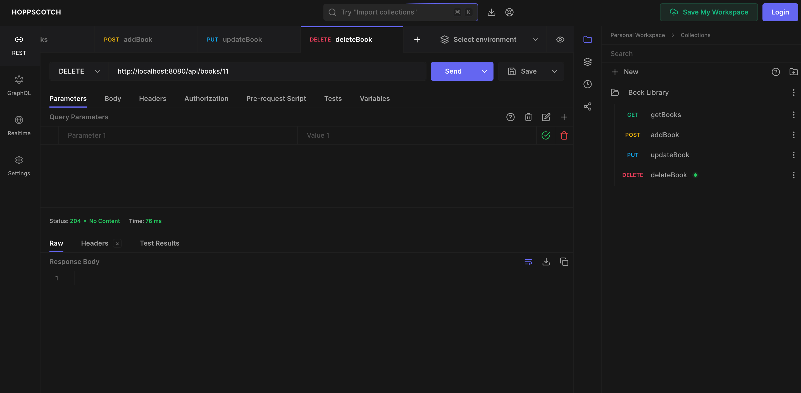

In the previous blog post, we covered the initial setup of a Book Library Project using Java Spring Boot. In this blog post, we will use Lombok to simplify the creation of the Book Entity class. We will then create a repository, service, and controller class to perform CRUD operations on the Book Entity.

## Using Lombok for the Book Entity

Lombok is a library that helps reduce boilerplate code in Java classes by providing annotations to generate getters, setters, constructors, and other common methods automatically. In this blog post, we will leverage Lombok to simplify the creation of the Book Entity class in our Java Spring Boot project.

<!-- truncate -->

- **Step 1: Add Lombok Dependency**

  To use Lombok in your project, you need to add the Lombok dependency to your `build.gradle` file. You can copy the latest version from the [Maven Central Repository](https://mvnrepository.com/artifact/org.projectlombok/lombok) or add the following line in the `dependencies` block:

  ```groovy
  compileOnly 'org.projectlombok:lombok:1.18.32'
  ```

  After adding the dependency, sync your Gradle project to download the Lombok library.

  |  |
  | --------------------------------------------------------------------- |

- **Step 2: Create the Book Entity Class**

  The Lombok `@Getter` and `@Setter` annotations automatically generate getter and setter methods for the fields in a Java class. `@Getter` creates a public method to retrieve the value of a field, while `@Setter` creates a public method to set the value of a field. This reduces boilerplate code, making the class definitions cleaner and easier to read.

  We will use these annotations to create the `Book` entity class. Open the `Book.java` file and add the following code:

  |  |
  | -------------------------------------------------------- |

### Get All Books

- **Step 3: Create the Book Repository**

  Next, we will create a repository interface to interact with the `Book` entity. Create a new interface named `BookLibraryRepository` in the package and extend it with the `JpaRepository` interface provided by Spring Data JPA:

  |  |
  | ------------------------------------------------- |

- **Step 4: Create the Book Service**

  Now, we will create a service class to handle business logic related to the `Book` entity. Create a new class named `BookLibraryService` in the `service` package and annotate it with `@Service`:

  |  |
  | ------------------------------------------- |

- **Step 5: Create the Book Controller**

  Finally, we will create a controller class to expose RESTful endpoints for CRUD operations on the `Book` entity. Create a new class named `BookLibraryController` in the `controller` package and annotate it with `@RestController`:

  |  |
  | ------------------------------------------------- |

- **Step 6: Start the server and test the API in the browser**

  Run the project and navigate to `http://localhost:8080/api/books` in your browser.
  You will see an empty ouput:

  |  |
  | ----------------------------- |

  Even though we have data in our H2 database, the browser shows an array with multiple empty objects. This is because the `BookLibraryRepository` is not mapping the data from the database to the JSON we are trying to return.

  I tried multiple StackOverflow solutions, such as adding a Lombok Plugin or the `jackson-databind dependency`, but none worked because the plugin doesn't help at runtime and the `jackson-databind` dependency was already present in the project as a default part of the `spring-boot-starter-web` dependency.

- **Step 7: Solution to the JSON issue**

  The solution was to add the `Lombok dependency` to the `build.gradle` file as a `annotationProcessor` along with the `compileOnly`. This is because the `annotationProcessor` scope is used to process annotations at compile time, necessary for Lombok to generate the necessary methods in the compiled class files. Sync the Gradle project after adding the `annotationProcessor` scope.

  The `compileOnly` part of the dependency is needed to compile the project, without which the import statements for the Lombok annotations would not be recognized by the compiler.

  :::note
  - Please install the Lombok Plugin from the IntelliJ IDEA marketplace (`Settings` -> `Plugins` ) to enable the IDE to recognize the Lombok annotations.
  - Then go into the `Settings` -> `Build, Execution, Deployment` -> `Compiler` -> `Annotation Processors` and check the box for `Enable annotation processing`.
  :::

  |  |
  | -------------------------------------------------- |

  Run the project again and navigate to `http://localhost:8080/api/books` in your browser. You should now see the list of books displayed correctly in JSON format.

  |  |
  | --------------------------------------------- |

- **Step 8: Testing the GET API using Hoppscotch.io**

  In the past, I used Postman to test the API, but now it requires users to create an account.I recently discovered [Hoppscotch.io](https://hoppscotch.io/), a free and open-source, lightweight, web-based API development suite. You can use it to test the GET API by entering the URL `http://localhost:8080/api/books` and clicking on the `Send` button.

  Since our app runs on `http`, Hoppscotch.io will throw an error. To solve this, you can use the Hoppscotch browser extension. It can be downloaded from the following links:

  [Hoppscotch Chrome Extension](https://chromewebstore.google.com/detail/hoppscotch-browser-extens/amknoiejhlmhancpahfcfcfhllgkpbld)

  [Hoppscotch Firefox Extension](https://addons.mozilla.org/en-US/firefox/addon/hoppscotch/)

  Once you have the extension installed, reload the page and re-send the request. Then choose the **Browser extension option** from the error and click on the `Send` button. You should see the list of books displayed in JSON format.

  |  |
  | --------------------------------------------- |

## CRUD Operations on the Book Entity

In the above section, we saw how to GET all the books from the database. Now, let's implement the remaining CRUD operations on the `Book` entity.

### Create a New Book

  To create a new book, we need to implement a `POST` API that accepts a JSON payload containing the book details. Add the following method to the `BookLibraryController` class:

  ```java
  // In BookLibraryController.java
    @PostMapping
    @ResponseStatus(HttpStatus.CREATED)
    public Book addBook(@RequestBody Book book) {
        return bookLibraryService.addBook(book);
    }
  ```

  We now create the Service method which will make the repository call to save the book.

  ```java
  // In BookLibraryService.java
    public Book addBook(Book book) {
        return bookLibraryRepository.save(book);
    }
  ```

  |  |
  | --------------------------------------------- |

  When you try to send a POST request you will encounter the following `SqlExceptionHelper` error.

  ```sh
    2024-06-01T17:33:42.470+01:00 ERROR 68886 --- [javaSpringBootBookLibrary] [nio-8080-exec-2] o.h.engine.jdbc.spi.SqlExceptionHelper   : Unique index or primary key violation: "PRIMARY KEY ON PUBLIC.BOOK(ID) ( /* key:1 */ 1, 'Harper Lee', 'A gripping novel about racial injustice.', 'To Kill a Mockingbird')"; SQL statement:
  insert into book (author,description,name,id) values (?,?,?,default) [23505-224]
  ```

  This error occurs because even though we are asking the database to auto-generate the `id`, the `id` field in the `Book` class, we are filling it with a value in the `data.sql` file. This causes a conflict when we try to insert a new book. To resolve this, remove the `id` field from the `data.sql` file.

  ```sql
  INSERT INTO BOOK (NAME, AUTHOR, DESCRIPTION) VALUES ('To Kill a Mockingbird', 'Harper Lee', 'A gripping novel about racial injustice.');
  INSERT INTO BOOK (NAME, AUTHOR, DESCRIPTION) VALUES ('Pride and Prejudice', 'Jane Austen', 'A classic romance novel.');
  INSERT INTO BOOK (NAME, AUTHOR, DESCRIPTION) VALUES ('The Great Gatsby', 'F. Scott Fitzgerald', 'A story of the American dream gone wrong.');
  INSERT INTO BOOK (NAME, AUTHOR, DESCRIPTION) VALUES ('Moby Dick', 'Herman Melville', 'A thrilling adventure of the whaling industry.');
  INSERT INTO BOOK (NAME, AUTHOR, DESCRIPTION) VALUES ('The Catcher in the Rye', 'J.D. Salinger', 'A novel about teenage rebellion.');
  INSERT INTO BOOK (NAME, AUTHOR, DESCRIPTION) VALUES ('The Hobbit', 'J.R.R. Tolkien', 'A fantasy adventure of a reluctant hero.');
  INSERT INTO BOOK (NAME, AUTHOR, DESCRIPTION) VALUES ('Crime and Punishment', 'Fyodor Dostoevsky', 'A psychological drama about guilt and redemption.');
  INSERT INTO BOOK (NAME, AUTHOR, DESCRIPTION) VALUES ('The Odyssey', 'Homer', 'An ancient epic of a hero''s journey home.');
  INSERT INTO BOOK (NAME, AUTHOR, DESCRIPTION) VALUES ('The Adventures of Sherlock Holmes', 'Arthur Conan Doyle', 'Mysteries solved by the famous detective.');
  INSERT INTO BOOK (NAME, AUTHOR, DESCRIPTION) VALUES ('Harry Potter and the Philosopher''s Stone', 'J.K. Rowling', 'The beginning of a young wizard''s journey.');
  ```

  Re-run your app and re-send the POST request on Hoppscotch.io. You should see a success message with the newly created book details.

  |  |
  | --------------------------------------------- |

### Update an Existing Book

  To update an existing book, we need to implement a `PUT` API that accepts the book `id` and the updated book details. Add the following method to the `BookLibraryController` class:

  ```java
  // In BookLibraryController.java
    @PutMapping(value = "/{id}")
    public ResponseEntity<Book> updateBook(@PathVariable int id, @RequestBody Book updatedBook) {
        Book updated = bookLibraryService.updateBook(id, updatedBook);
        return new ResponseEntity<>(updated, HttpStatus.OK);
    }
  ```

  We now create the Service method which will make the repository call to update the book.

  ```java
  // In BookLibraryService.java
    public Book updateBook(int id, Book updatedBook) {
        if (updatedBook.getId() != id) {
            throw new RuntimeException("The ID in the request body does not match the ID in the URL.");
        }
        Optional<Book> optionalBook = bookLibraryRepository.findById(id);
        if (optionalBook.isPresent()) {
            Book existingBook = optionalBook.get();
            existingBook.setName(updatedBook.getName());
            existingBook.setAuthor(updatedBook.getAuthor());
            existingBook.setDescription(updatedBook.getDescription());
            return bookLibraryRepository.save(existingBook);
        } else {
            throw new RuntimeException(String.format("Book with id {%s} not found", id));
        }
    }
  ```

  |  |
  | --------------------------------------------- |

### Delete a Book

  To delete a book, we need to implement a `DELETE` API that accepts the book `id`. Add the following method to the `BookLibraryController` class:

  ```java
  // In BookLibraryController.java
    @DeleteMapping(value = "/{id}")
    @ResponseStatus(HttpStatus.NO_CONTENT)
    public void deleteBook(@PathVariable int id) {
        bookLibraryService.deleteBook(id);
    }
  ```

  We now create the Service method which will make the repository call to delete the book.

  ```java
  // In BookLibraryService.java
    public void deleteBook(int id) {
        bookLibraryRepository.deleteById(id);
    }
  ```

  |  |
  | --------------------------------------------- |

  With that, we have successfully implemented the CRUD operations on the `Book` entity in our Java Spring Boot project.

:::info
  Part 3 of this series will cover the testing of the CRUD operations using JUnit and Mockito. We will also create API documentation using [Swagger.io](https://swagger.io/) and update our codebase with exception handling.
:::
