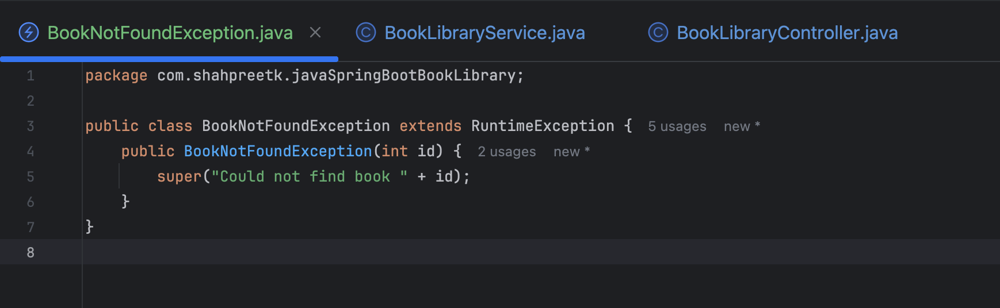
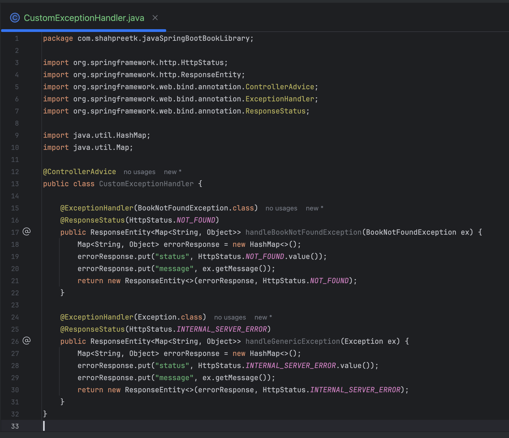
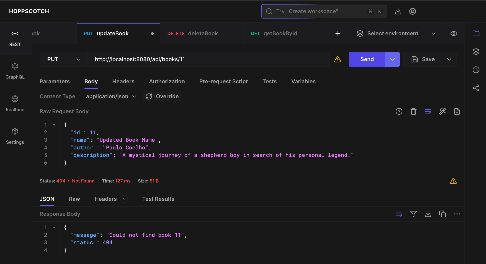
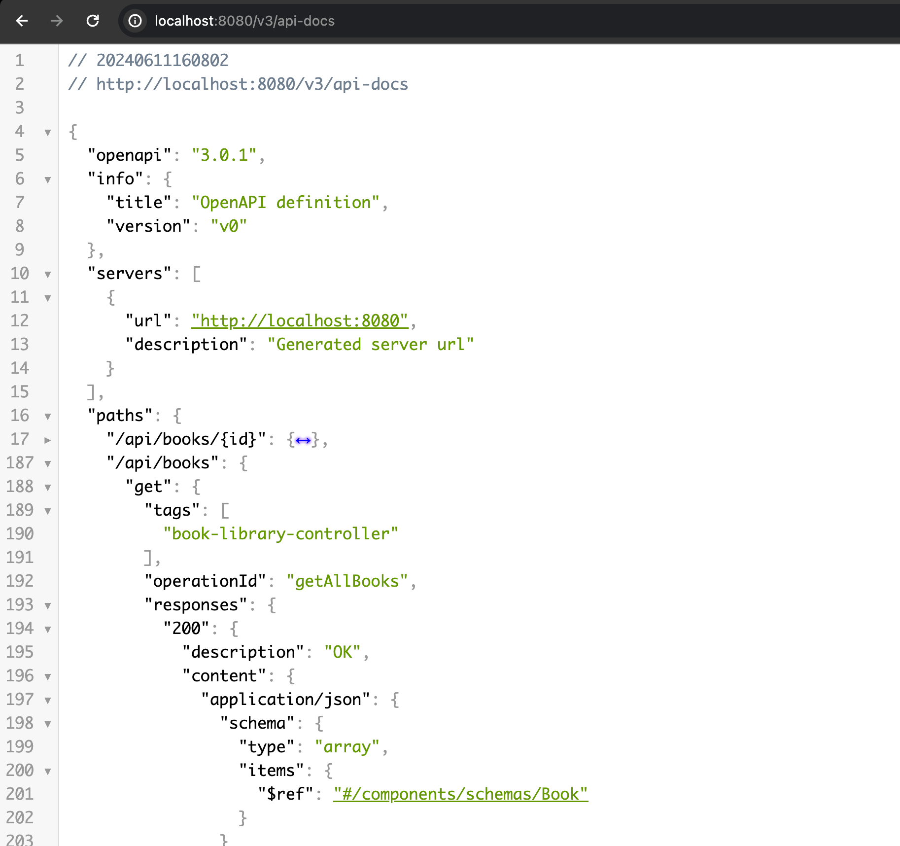
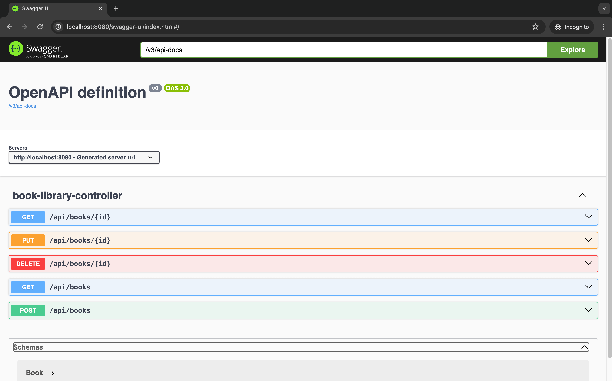

In the previous blog post, we used Lombok to reduce boilerplate code and added CRUD operations to our Spring Boot project. In this blog post, we will write unit tests for the CRUD operations using JUnit and Mockito. We will also create API documentation using [Swagger](https://swagger.io/) and update our codebase with exception handling.

<!-- truncate -->

## Custom Exception Handling

Custom exception handling is invaluable as it allows us to define and throw exceptions specific to our application's needs. By creating custom exceptions, we can handle specific conditions and scenarios more effectively. This not only makes our codebase cleaner and more maintainable but also simplifies debugging by providing clear, meaningful error messages. Additionally, custom exceptions enhance the user experience by offering precise and understandable feedback when errors occur.

We will create a custom exception class named `BookNotFoundException` that extends the `RuntimeException` class. This exception will be unchecked, meaning it occurs at runtime. It will be thrown when a user searches for or attempts to update a book that is not found in the database.

|  |
| --------------------------------------------------------------------- |

Update the `updateBook(int id, Book updatedBook)` method in the `BookService` class to throw a `BookNotFoundException` if the book is not found in the database.

```java
  public Book updateBook(int id, Book updatedBook) {
      if (updatedBook.getId() != id) {
          throw new RuntimeException("The ID in the request body does not match the ID in the URL.");
      }
      Optional<Book> optionalBook = bookLibraryRepository.findById(id);
      if (optionalBook.isPresent()) {
          Book existingBook = optionalBook.get();
          existingBook.setName(updatedBook.getName());
          existingBook.setAuthor(updatedBook.getAuthor());
          existingBook.setDescription(updatedBook.getDescription());
          return bookLibraryRepository.save(existingBook);
      } else {
          throw new BookNotFoundException(id);
      }
  }
```

If we run the application and attempt to update a book that does not exist in the database, a `BookNotFoundException` will be thrown, displaying a message in the console logs indicating that the book was not found. However, the response displayed in Hoppscotch.io will still be unclear and generic.

To provide a more user-friendly message in the response body, we need to create a custom error response class. This class will contain the error message and status code that will be returned to the user when an exception occurs.

Create a new class named `CustomExceptionHandler`. This class will be annotated with `@ControllerAdvice` and will contain methods to handle specific exceptions. In this case, we will create a method to handle the `BookNotFoundException`.

:::note
  `@ControllerAdvice` in Spring is an annotation used to handle exceptions globally across all controllers. It allows you to define common exception handling logic in one place, ensuring consistent error responses throughout your application. Additionally, you can use it to add global attributes and configure data binding for all controllers, making your code cleaner and easier to maintain.
:::

|  |
| --------------------------------------------------------------------- |

Re-run the application and attempt to update a book that does not exist in the database. The response will now include a custom error message indicating that the book was not found.

|  |
| --------------------------------------------------------------------- |

Similarly, you can create custom exception classes and handlers for other scenarios in your application. For example, I have implemented a service and controller method to GET a book by its ID and used the `BookNotFoundException` to handle cases where the book is not found in the database. You can check out the complete codebase in my [GitHub repository](https://github.com/shahpreetk/java-spring-boot-book-library).

## API Documentation with Swagger

API documentation is essential for developers using your API. It provides detailed information about the endpoints, request and response formats, error codes, and other relevant details. By creating API documentation, you make it easier for developers to understand and interact with your API, reducing the learning curve and enabling faster integration.

[Swagger](https://swagger.io/) is a popular tool for generating API documentation. It allows you to define your API using the OpenAPI Specification (formerly known as Swagger Specification) and automatically generates interactive documentation based on your API definition. Swagger provides a user-friendly interface that displays all your endpoints, request and response formats, and other details in an organized and visually appealing manner.

To generate the Swagger documentation for our Spring Boot project, we will use the `springdoc-openapi` library. This library integrates Swagger with Spring Boot, allowing you to create API documentation easily and efficiently. Add the following code to the `build.gradle` file.

```groovy
  implementation 'org.springdoc:springdoc-openapi-starter-webmvc-ui:2.5.0'
```

Run the application and navigate to [http://localhost:8080/v3/api-docs](http://localhost:8080/v3/api-docs) to view the generated OpenAPI JSON documentation.

|  |
| --------------------------------------------------------------------- |

You can now navigate to [http://localhost:8080/swagger-ui.html](http://localhost:8080/swagger-ui.html) to view the Swagger UI interface, which offers an interactive documentation view of your API. The springdoc-openapi library includes Swagger UI out-of-the-box, so no additional setup is required. Currently, since we haven't added any custom annotations or descriptions to our endpoints, Swagger UI will display the default information based on the request and response objects. To enhance the documentation, you can add custom annotations and descriptions to your controllers and endpoints. You can check my [GitHub repository](https://github.com/shahpreetk/java-spring-boot-book-library) for the complete codebase.

|  |
| --------------------------------------------------------------------- |

## Unit Testing with JUnit and Mockito

Unit testing is a critical aspect of software development. It allows you to test individual units or components of your codebase in isolation, ensuring that each unit functions correctly and meets the specified requirements. By writing unit tests, you can identify bugs and issues early in the development process, improve code quality, and increase the reliability and maintainability of your application.

We will use [Mockito](https://site.mockito.org/) to mock dependencies and [JUnit](https://junit.org/junit5/) to write test cases for our service and controller classes. Mockito is a popular mocking framework that allows you to create mock objects for dependencies, enabling you to test your code in isolation. JUnit is a widely used testing framework for Java that provides annotations and assertions to write test cases and validate the behavior of your code.

For the Controller class, we will write test cases using `MockMvc` to test the CRUD operations. MockMvc is a Spring testing framework that allows you to test Spring MVC controllers without starting a full HTTP server. It provides a fluent API for making requests and validating responses, making it easy to write comprehensive tests for your controllers.

Create a `BookLibraryControllerTest` class in the `src/test/java/com/example/booklibrary/controller` package.

```java
package com.shahpreetk.javaSpringBootBookLibrary.controller;

import com.shahpreetk.javaSpringBootBookLibrary.Book;
import com.shahpreetk.javaSpringBootBookLibrary.exceptions.BookNotFoundException;
import com.shahpreetk.javaSpringBootBookLibrary.exceptions.CustomExceptionHandler;
import com.shahpreetk.javaSpringBootBookLibrary.service.BookLibraryService;
import org.junit.jupiter.api.BeforeEach;
import org.junit.jupiter.api.Test;
import org.mockito.InjectMocks;
import org.mockito.Mock;
import org.mockito.MockitoAnnotations;
import org.springframework.http.MediaType;
import org.springframework.test.web.servlet.MockMvc;
import org.springframework.test.web.servlet.setup.MockMvcBuilders;

import java.util.List;

import static org.hamcrest.Matchers.hasSize;
import static org.mockito.ArgumentMatchers.any;
import static org.mockito.ArgumentMatchers.anyInt;
import static org.mockito.Mockito.when;
import static org.springframework.test.web.servlet.request.MockMvcRequestBuilders.get;
import static org.springframework.test.web.servlet.request.MockMvcRequestBuilders.post;
import static org.springframework.test.web.servlet.result.MockMvcResultMatchers.jsonPath;
import static org.springframework.test.web.servlet.result.MockMvcResultMatchers.status;

public class BookLibraryControllerTest {

    private MockMvc mockMvc;

    @Mock
    private BookLibraryService bookLibraryService;

    @InjectMocks
    private BookLibraryController bookLibraryController;

    @BeforeEach
    public void setUp() {
        MockitoAnnotations.openMocks(this);
        mockMvc = MockMvcBuilders.standaloneSetup(bookLibraryController)
                .setControllerAdvice(new CustomExceptionHandler())
                .build();
    }

    private Book createBook(int id, String name, String author, String description) {
        Book book = new Book();
        book.setId(id);
        book.setName(name);
        book.setAuthor(author);
        book.setDescription(description);
        return book;
    }

    @Test
    public void testGetAllBooks() throws Exception {
        Book book1 = createBook(1, "Book1", "Author1", "Description1");
        Book book2 = createBook(2, "Book2", "Author2", "Description2");
        List<Book> books = List.of(book1, book2);

        when(bookLibraryService.getAllBooks()).thenReturn(books);

        mockMvc.perform(get("/api/books"))
                .andExpect(status().isOk())
                .andExpect(jsonPath("$", hasSize(2)))
                .andExpect(jsonPath("$[0].id").value(1))
                .andExpect(jsonPath("$[0].name").value("Book1"))
                .andExpect(jsonPath("$[0].author").value("Author1"))
                .andExpect(jsonPath("$[0].description").value("Description1"))
                .andExpect(jsonPath("$[1].id").value(2))
                .andExpect(jsonPath("$[1].name").value("Book2"))
                .andExpect(jsonPath("$[1].author").value("Author2"))
                .andExpect(jsonPath("$[1].description").value("Description2"));
    }
}
```

In the `BookLibraryControllerTest` class, we have created a test case for the `getAllBooks()` method in the `BookLibraryController` class. We have mocked the `BookLibraryService` dependency using Mockito and defined the behavior of the `getAllBooks()` method to return a list of books. We then use MockMvc to perform a GET request to the `/api/books` endpoint and validate the response using assertions.

You can write similar test cases for other controller methods and service classes to ensure that your code functions correctly and handles various scenarios effectively. You can find the entire test suite in my [GitHub repository](https://github.com/shahpreetk/java-spring-boot-book-library).

```java
package com.shahpreetk.javaSpringBootBookLibrary.service;

import com.shahpreetk.javaSpringBootBookLibrary.Book;
import com.shahpreetk.javaSpringBootBookLibrary.BookLibraryRepository;
import com.shahpreetk.javaSpringBootBookLibrary.exceptions.BookNotFoundException;
import org.junit.jupiter.api.BeforeEach;
import org.junit.jupiter.api.Test;
import org.mockito.InjectMocks;
import org.mockito.Mock;
import org.mockito.MockitoAnnotations;

import java.util.List;
import java.util.Optional;

import static org.junit.jupiter.api.Assertions.assertEquals;
import static org.junit.jupiter.api.Assertions.assertThrows;
import static org.mockito.ArgumentMatchers.any;
import static org.mockito.Mockito.when;

public class BookLibraryServiceTest {

    @Mock
    private BookLibraryRepository bookLibraryRepository;

    @InjectMocks
    private BookLibraryService bookLibraryService;

    @BeforeEach
    public void setUp() {
        MockitoAnnotations.openMocks(this);
    }

    private Book createBook(int id, String name, String author, String description) {
        Book book = new Book();
        book.setId(id);
        book.setName(name);
        book.setAuthor(author);
        book.setDescription(description);
        return book;
    }

    @Test
    public void testGetAllBooks() {
        Book book1 = createBook(1, "Book1", "Author1", "Description1");
        Book book2 = createBook(2, "Book2", "Author2", "Description2");

        when(bookLibraryRepository.findAll()).thenReturn(java.util.List.of(book1, book2));

        List<Book> result = bookLibraryService.getAllBooks();

        assertEquals(2, result.size());
        assertEquals("Book1", result.getFirst().getName());
        assertEquals("Author1", result.get(0).getAuthor());
        assertEquals("Description1", result.get(0).getDescription());
        assertEquals("Book2", result.get(1).getName());
        assertEquals("Author2", result.get(1).getAuthor());
        assertEquals("Description2", result.get(1).getDescription());
    }
}
```

`@Mock` annotation is used to create and initialize mock instances of the fields it is applied to. When a field is annotated with `@Mock`, Mockito will create a mock implementation of that field which can then be used in your tests to simulate the behavior of the actual dependency. This allows you to define how the mock should behave when certain methods are called, without actually invoking the real methods. It's particularly useful for isolating the class under test from its dependencies.

`@InjectMocks` annotation is used to create an instance of the class under test and inject the mock dependencies into it. When a class field is annotated with `@InjectMocks`, Mockito will automatically inject the mocks created with `@Mock (or @Spy)` into this instance. This simplifies the setup process by automatically performing dependency injection, ensuring that the class under test is properly initialized with all its dependencies mocked. This allows you to focus on testing the behavior of the class without worrying about the initialization of its dependencies.


`MockitoAnnotations.openMocks(this)` is a method used in Mockito to initialize the mocks and inject them into the annotated fields of the test class. This method is typically used in the `@BeforeEach` setup method to ensure that the mocks are properly set up before each test case runs.

You can write similar test cases for other service methods to ensure that your code functions correctly and handles various scenarios effectively. You can find the entire test suite in my [GitHub repository](https://github.com/shahpreetk/java-spring-boot-book-library).

This is how you can write unit tests for your Spring Boot application using JUnit and Mockito, create API documentation using Swagger, and update your codebase with custom exception handling. By following these best practices, you can improve the quality, reliability, and maintainability of your codebase, making it easier to develop, test, and deploy your applications.

## Conclusion

In this three-part blog series, we explored building a Book Library application with Java Spring Boot. We started with project setup and dependencies, then used Lombok for simplifying entity classes and implemented CRUD operations. Finally, we covered unit testing and custom exception handling, emphasizing their importance for robust application development. By following these steps, you’ve created a scalable and maintainable Spring Boot application.

:::info
 For the complete codebase, visit my [GitHub repository](https://github.com/shahpreetk/java-spring-boot-book-library).
:::

Happy coding! 🚀
