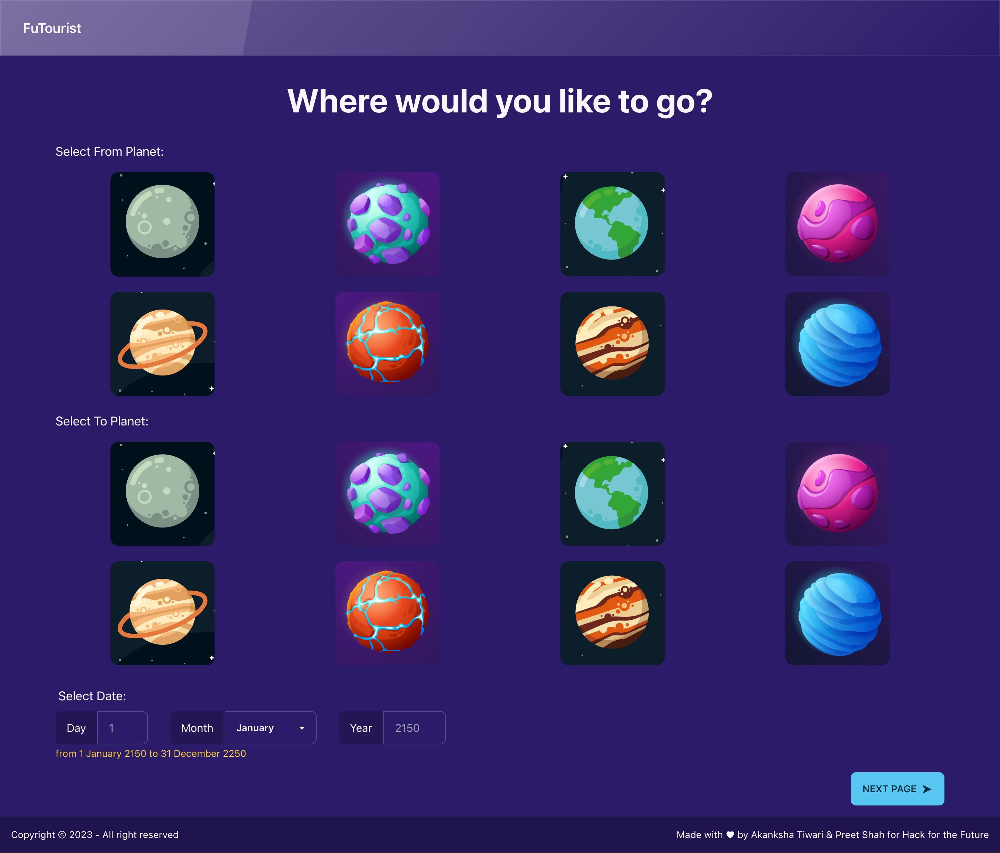

# FuTourist

This project was created as part of [Hack for the Future](https://hack-for-the-future.devpost.com/), a 48-hour hackathon organised by MLH.

## 🏆 Achievement 🏆

:::info

- Third Overall
  :::

## 💭 Inspiration 💭

FuTourist is made in 2150 where travelling to any intergalactic planet is possible. Our inspiration for this was every Marvel, DC Comics, Star Wars and Star Trek movie ever made. The beauty of the space and the dream of becoming an astronaut as a child is what inspired us to make this hack for Hack for the Future. We imagine that in 2150 every human would be able to travel to space by easily booking through our site! 🚀

## 💻 What it does 💻

FuTourist allows everyone to choose which planets they want to travel between and on which date. Then it gives users an option to book for multiple people by selecting the number of people travelling. It provides the user with three spaceship options - one being the cheapest and longest journey, one a little faster, and the final option being a private spaceship. Users can then make a payment on the app and ask for the details being sent to them via SMS.

## 🛠️ How we built it 🛠️

Frontend: React.js, DaisyUI, axios Backend: Node.js, expressjs, twilio We used the Issues and PR feature of GitHub to divide the tasks into manageable chunks and push code periodically. We have also hosted the frontend on Github Pages. The sending details via SMS feature was possible thanks to Twilio.

## 🪨 Challenges we ran into 🪨

Integration of Twilio was difficult and gave quite a few errors in the beginning.

While using useNavigate in react, it kept routing to the end of the new page.

Github Pages not showing the content between navbar and footer properly.

## 🏆 Accomplishments that we're proud of 🏆

This is the first time we've ever used Twilio so we're glad we could get it up and connected.

We also added the fire animation on to the spaceships by ourselves. That was fun to do.🔥

We purchased a domain "futourist.tech" which is a wordplay on Future, Tourist and Tech!

## 📖 What we learned 📖

We learned how to use Twilio and DaisyUI.

## ⚙️ Built With ⚙️

- [React](https://react.dev/)
- [Node.js](https://nodejs.org/en/)
- [Express](https://expressjs.com/)
- [daisyUI](https://daisyui.com/)
- [tailwindcss](https://tailwindcss.com/)
- [GitHub Pages](https://pages.github.com/)
- [Twilio](https://www.twilio.com/en-us)

## 💻 Try it Out 💻

:::success

- [FuTourist Website](https://shahpreetk-ncl.github.io/futourist/)
- [Github Repo](https://github.com/shahpreetk-NCL/futourist)
- [Devpost Link](https://devpost.com/software/futourist)
  :::
