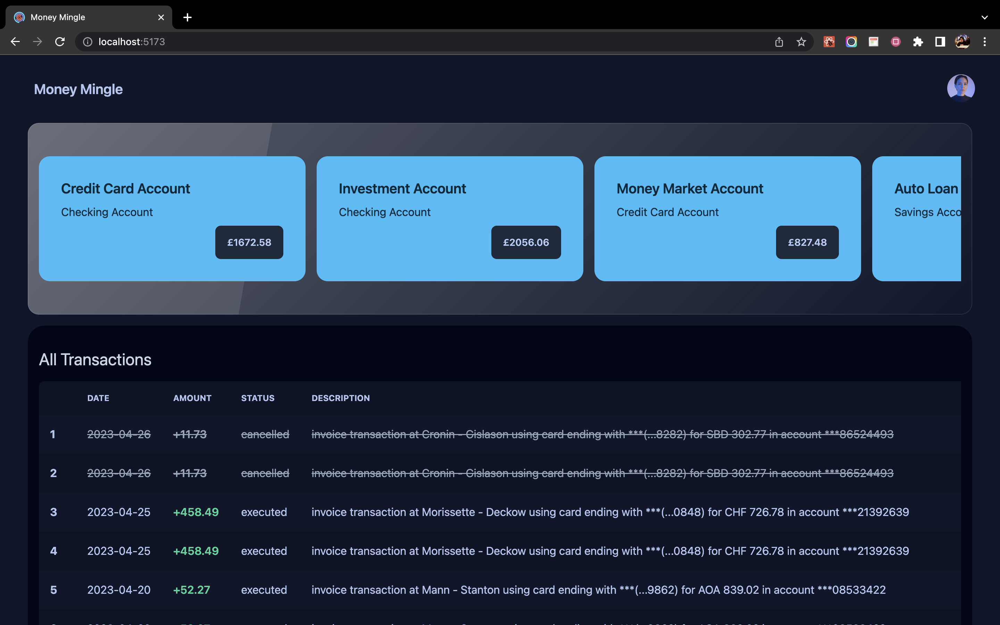

# Money Mingle

This project was created as part of [Tech Together Digital Hackathon](https://techtogether-digital.devpost.com/), a 48-hour hackathon organised by MLH.

## 🏆 Achievement 🏆

:::info

- Second Overall
- Best Financial Hack with Capital One
- Best Use of Microsoft Cloud for Your Community
  :::

## 💭 Inspiration 💭

I've always wanted to monitor my expenses. So, for this hackathon with access to Capital One API I thought of creating a finance dashboard that will help me keep my finances in check.

## 💻 What it does 💻

Meet Money Mingle, the personal finance dashboard that takes your financial management to the next level! With Money Mingle, you can easily monitor your spending, and track your expenses. Our platform provides you with insightful analytics that help you make smart financial decisions. Whether you want to save for a rainy day, pay off debt, or invest in your future, Money Mingle has got you covered.

## 🛠️ How we built it 🛠️

Since I have never used the Capital One API or any similar financial API before, I decided to use it this weekend for the Tech Together hackathon. On signing up to use the API, I discovered that we had to do the data entry for using the API. On researching I found that Faker.js provides fake data. So, I wrote code to generate and push this data to the Capital One API. The code for this can be found in the github repo. Once this was done, I mulled over a few project ideas that could be made using this API and decided on a finance dashboard. Using Vite for the first time, I created a React project along with Daisy UI as my CSS library and went ahead with getting the API data on there to display to the user.

## 🪨 Challenges we ran into 🪨

The Capital One Nessie API provides deposits and withdrawals separately. I wanted to show all transactions and hence needed to collate all the data, sort through transaction_date and then display it. While doing so, I ran into a few issues but was able to do so in the end. I also ran into an issue of trying to expand the project to multiple pages. But because of time limitations, doing so was not possible without sending multiple requests for the same data. Had some issues deploying due to http/https error. Attached a screenshot of the same.

## 🏆 Accomplishments that we're proud of 🏆

- Using Capital One Finance API
- Using plotly.js for visualization

## 📖 What we learned 📖

I used Vite for the very first time and it has an amazingly fast refresh speed.
This was also the first time I used faker.js to generate fake data and post it to an API

## ⚙️ Built With ⚙️

- [Nessie - Capital One's Hackathon API](http://api.nessieisreal.com/)
- [CSS](https://developer.mozilla.org/en-US/docs/Web/CSS)
- [daisyUI](https://daisyui.com/)
- [Faker](https://fakerjs.dev/)
- [Plotly](https://plotly.com/javascript/)
- [React Router](https://reactrouter.com/en/main/start/overview)
- [tailwindcss](https://tailwindcss.com/)
- [Vite](https://vitejs.dev/)

## 💻 Try it Out 💻

:::success

- [Github Repo](https://github.com/shahpreetk-NCL/tech-together-hackathon)
- [Devpost Link](https://devpost.com/software/money-mingle)
  :::
