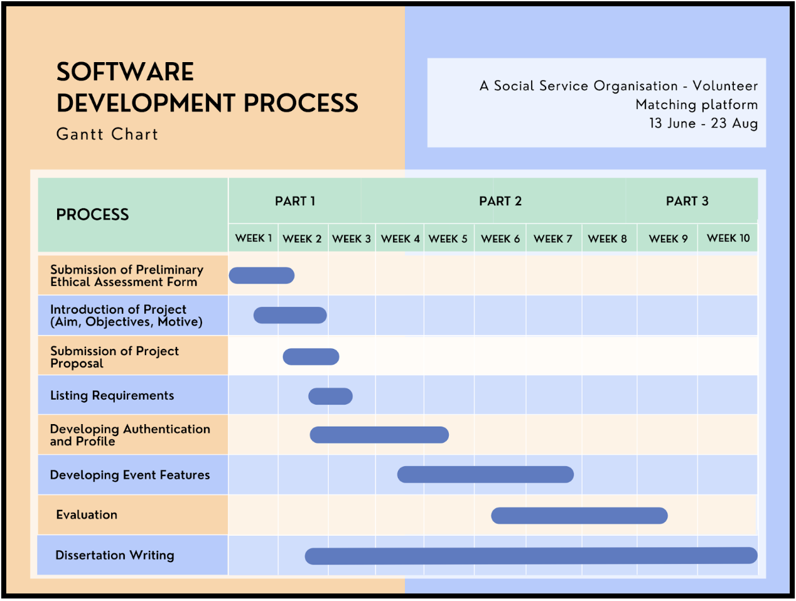

# Social Spirit

This project was created as part of MSc Computer Science thesis.

## 🏆 Achievement 🏆

:::info

- Passed with Distinction
- Obtained 70% on the thesis and project.
  :::

## 💭 Inspiration 💭

According to statistics from March 2022, there are 170,383 charitable organisations operating in England and Wales. Even yet, not all of the volunteer opportunities available via charitable organisations are posted on a single platform, as found from our research of existing solutions in part 2.5. A volunteer searching for an event would need to check through the websites of many different charities before finding the one that meets all of their requirements the best.

The websites that do provide volunteer opportunities often also feature a wealth of other information and opportunities, many of which have nothing to do with volunteering in any way, shape, or form. Because of this, it is quite difficult to navigate the site in order to look for events because it is so confusing. Eventbrite and Get Volunteering are two websites that come to mind as potential candidates for this category. Get Volunteering, on the other hand, will send volunteers to third-party websites and will not delete old events, which is why there are many broken links associated with the event. This is in contrast to Eventbrite, which has a large number of sponsored events. It was also found that volunteers face many issues in joining an organisation and while volunteering as part of the organisation, the details of which are mentioned in part 2.4.

As a result, the purpose of this platform is to simplify the process of volunteering at events so that more people can take part. In addition to this, it intends to bring together all charitable organisations into a single platform so that information may be easily accessed by anybody.

## 💻 What it does 💻

The platform connects potential volunteers with organisations undertaking service activities. It is a geo-volunteering platform which helps prospective volunteers find service activities pertaining to their interests and calibre.

## 🛠️ How we built it 🛠️

## 🪨 Challenges we ran into 🪨

Only a certain amount of time could be devoted to developing the project since it required a list of criteria, a low-fidelity design, followed by an evaluation to determine if the project would be successful or not. The whole implementation would have been achievable if there had been enough time to devote to it.

## 🏆 Accomplishments that we're proud of 🏆

- Time management was a great part of this project as it required writing the thesis itself. The project was completed on time.
- Executing a user study to first understand the requirement and then to evaluate the solution.
- Following the entire SDLC for the project.

## 📖 What we learned 📖

- E2E testing using Cypress.
- State management using React Redux.

## ⚙️ Built With ⚙️

- [React](https://reactjs.org/)
- [Tailwind CSS](https://tailwindcss.com/)
- [daisyUI](https://daisyui.com/)
- [cypress](https://www.cypress.io/)
- [react-redux](https://react-redux.js.org/)
- [Node.js](https://nodejs.org/en/)
- [Express](https://expressjs.com/)
- [bcrypt.js](https://www.npmjs.com/package/bcryptjs)
- [JSON web tokens](https://www.npmjs.com/package/jsonwebtoken)
- [dotenv](https://www.npmjs.com/package/dotenv)
- [MongoDB](https://www.mongodb.com/)
- [Netlify](https://www.netlify.com/)
- [Heroku](https://www.heroku.com/)

## 🖥 Try It Out 🖥

:::success

- [Frontend code](https://github.com/shahpreetk/socialspirit-frontend)
  :::
