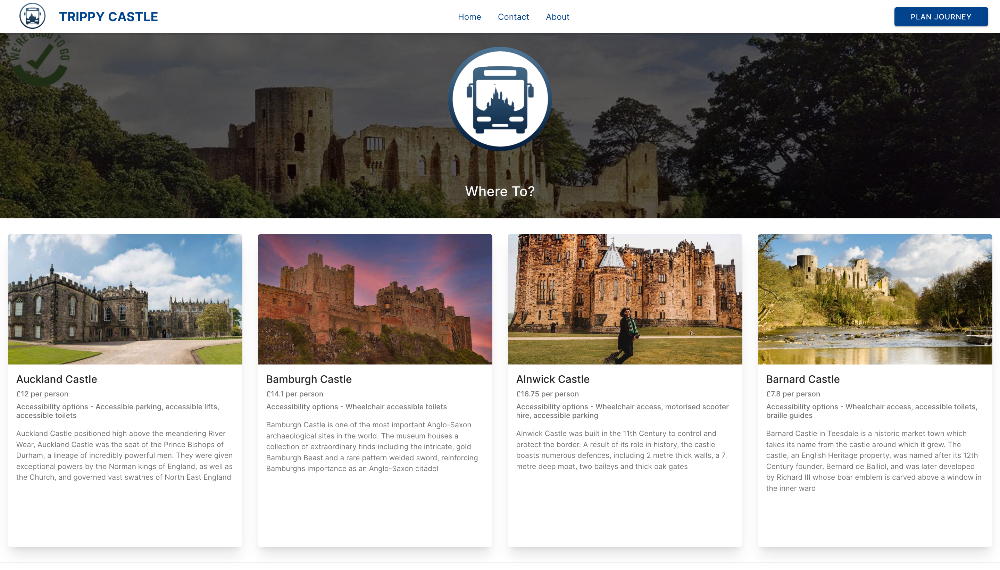

# Trippy Castle

This was a team project made for a module in my Masters degree course.

## 🏆 Achievement 🏆

:::info

- Successfully completed 6/6 basic requirements and 2/5 advanced requirements.
- Received a Pass with Merit grade for the module.
  :::

## 👩‍🏫 Project Brief 👩‍🏫

Your team is being asked to develop an app to allow University students to plan a day trip using local bus services to one of the following historic castles:

- Alnwick Castle
- Auckland Castle
- Bamburgh Castle
- Barnard Castle

Each day trip will start and end at either Newcastle Haymarket Bus Station or Newcastle Eldon Square Bus Station depending on the castle visited.

### _You can find more information in the project [wiki](https://github.com/shahpreetk/trippycastle/wiki)_

## 💻 How to use Trippy Castle 💻

You can plan a journey with Trippy Castle easily!

Follow these steps:

- Select the castle you want to visit on the home page.
- Click on "Plan Journey" in the Navbar.
- Select the Source, Destination, Number of Travellers, Date and Time of travel and click on "Get Details".
- Select an Onward Journey Bus from the given options, by simply clicking on the option.
- Select a Return Journey Bus.
- You will now be shown your entire Journey Itinerary details.
- You can now print your journey details or plan another journey.

## 🛠 Built with 🛠

UI - The prototyping and designing of the website was done on Adobe XD.

Frontend:

- The frontend of this journey planning system is made using the [Reactjs](https://react.dev/) UI library. It helps in making a single-page application (SPA) that ensures fast rendering.
- The [Ionic](https://ionicframework.com/) Framework has been used for the styling of the web app.
- To give the user a feeling of content being loaded, we show a loader using [react-loading-skeleton](https://www.npmjs.com/package/react-loading-skeleton)
- The backend sends the data using [Axios](https://axios-http.com/docs/intro).
- The state management of the user selections has been done using [React Hooks](https://react.dev/reference/react/hooks).

Backend - The back-end program is developed by using the framework of [Springboot](https://spring.io/projects/spring-boot) and [myBatis](https://mybatis.org/mybatis-3/).

Database - The database is created on [MySQL](https://www.mysql.com/)

## 🖥 Try It Out 🖥

:::success

- [Frontend Code](https://github.com/shahpreetk/trippycastle)
  :::

## 🧑‍💻👩‍💻 Team 04 🧑‍💻👩‍💻

This project was built with ❤️ by [Hao Xue](https://github.com/Xuehao0627), [Oliver Miller](https://github.com/c1026092), [Preet Shah](https://github.com/shahpreetk), [Sibo Cheng](https://github.com/SiboUK), [Suna Fawal](https://github.com/SunaFawal) and [Thomas Delillo](https://github.com/ThomasDeLillo99).
